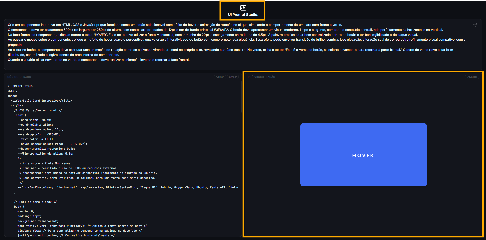

# UI Prompt Studio

Interface minimalista para geração de código HTML, CSS e JavaScript via IA.
Digite uma instrução em linguagem natural e receba código funcional com pré-visualização em tempo real.

## Como usar

1. Clone o repositório
2. Substitua `SUA_KEY_AQUI` pela sua Gemini API Key em `app.js`
3. Abra `index.html` em um servidor local (ex: `npx serve .`)

## Stack

- HTML, CSS e JavaScript puro (vanilla)
- Gemini 2.5 Flash API (Google AI Studio)
- Sem frameworks, sem dependências externas

## Funcionalidades

- Geração de código via IA especializada em design de interfaces
- Pré-visualização ao vivo em iframe isolado
- Tratamento de rate limit com retry automático e contagem regressiva
- Textarea com auto-resize e envio por Enter
